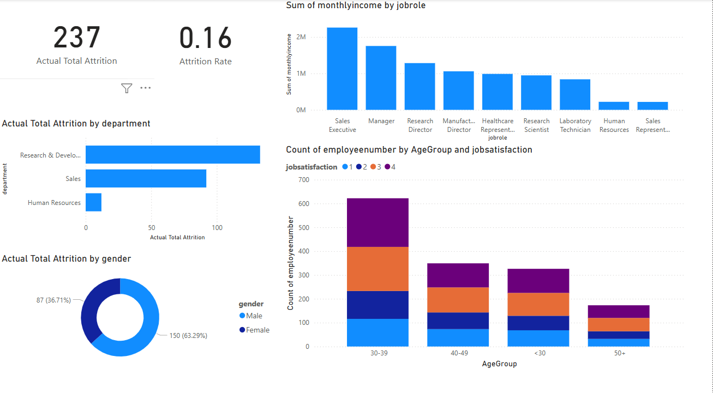
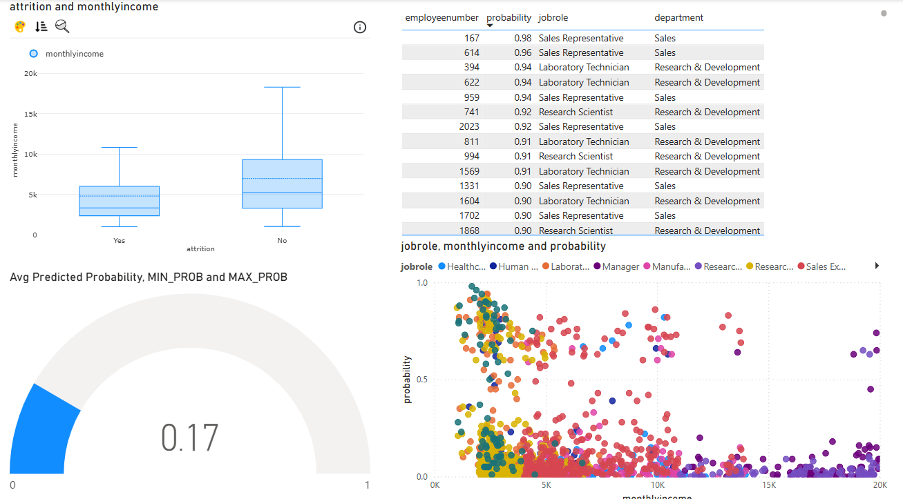

# HR_attrition_pipeline

A full-stack data analytics and machine learning pipeline built to analyze and predict employee attrition using PostgreSQL, dbt, Power BI, and Python.

---

## 🗂 Project Overview

This project simulates a real-world HR analytics scenario by:
- Cleaning and transforming raw employee data using dbt
- Generating insights and KPIs via Power BI dashboards
- Training and deploying a Random Forest classifier for attrition prediction
- Automating data refresh and ML inference workflows

---

## 🔧 Tech Stack

| Layer | Tools |
|-------|-------|
| **Database** | PostgreSQL |
| **Modeling** | dbt |
| **Dashboarding** | Power BI |
| **Machine Learning** | Python (scikit-learn, pandas) |
| **Automation** | CRON jobs / dbt Cloud Scheduler / Power BI Gateway |

---

## 📊 Dashboards Preview

Paste your final Power BI screenshots in this section:

### 📌 Dashboard 1: Attrition Overview
- KPI Cards: Total Employees, Total Attrition, Attrition Rate
- Bar Charts: Attrition by Department, Age Group, Gender
- Donut Charts: Business Travel, Marital Status distribution

---

### 📌 Dashboard 2: Employee Insights
- Bar Chart: Monthly Income by Job Role
- Stacked Column: Job Satisfaction by Age Group
- Box Plot: Monthly Income by Attrition
- Slicers: Work-Life Balance, OverTime, YearsAtCompany

---

### 📌 Dashboard 3: Prediction Results (ML)
- Gauge: Predicted Attrition Probability
- Bar Chart: Top 10 At-Risk Employees
- Scatterplot: Probability vs Monthly Income
- Table: EmployeeNumber, Prediction (Yes/No), Probability %

![ML Dashboard]

---

## 📁 Folder Structure
├── README.md
├── .gitignore
├── dbt/
│   ├── dbt_project.yml
│   ├── profiles.yml.example
│   ├── models/
│   │   ├── staging/
│   │   │   └── stg_hr_employee_attrition.sql
│   │   ├── intermediate/
│   │   │   └── int_hr_attrition_features.sql
│   │   ├── final/
│   │   │   └── fct_attrition_summary.sql
│   │   └── ml/
│   │       └── ml_attrition_predictions.sql
│   └── seeds/
│       └── hr_employee_attrition.csv
├── ml_model/
│   ├── train_model.ipynb
│   ├── predict_attrition.py
│   ├── model.pkl
│   └── requirements.txt
├── sql_queries/
│   └── exploratory_analysis.sql
├── dashboards/
│   └── employee_attrition.pbix
└── docs/
    ├── powerbi_screenshots/
    └── dbt_docs/
